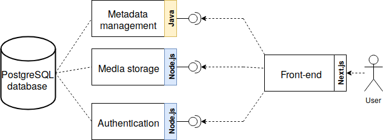

# What is this project?
This is a project for a Cloud computing course. In this project, we implement the basic functionalities of a music streaming platform. Languages used are Java (enterprise, i.e. Jakarta EE) and Node.js.  

The overall functionality is divided into microservices, which are small components of the app that are designed to handle a specific part the entire functionality.  
In our example, this includes *metadata management* (data about artists, songs, playlists,...), *authentication*, *media storage*, *recommender system* and *front-end* microservices.

Some other concepts that we also use in this project are service discovery, configuration management (etcd), containerization (Docker, docker-compose), container orchestration (Kubernetes).

# Architecture
**TODO: a more detailed description of architecture, perhaps?**
